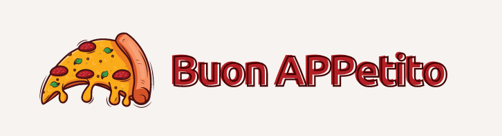

This is my solution for the challenge [Buon APPetito](https://bit.ly/3DdS5HY), which is part of the challenge series [Retos de Programación Mensuales 2022](https://retosdeprogramacion.com/mensuales2022) by [MoureDev](https://www.twitch.tv/mouredev).

>You can check all the details and requirements [here](./original-readme/README.md)

## User notes

This app is a [**PWA**](https://web.dev/i18n/es/progressive-web-apps/) made with [**Next.js**](https://nextjs.org/) and it's deployed on [**Vercel**](https://vercel.com/). You can visit it [here](http://bit.ly/3EEaeiS), but **for the best experience I strongly recommend you to scan this QR** with your mobile and even install it to use as any other app:

As this challenge claims:

> The aim of this app is to allow a pizza delivery business to handle orders from users who are starving of a perfect and yummy pizza! 🍕 Why is this app better than some actual ones? Clients do not need to register, they can order 4-halve pizzas (or
even more!), they can remove some toppings and... a final trick to avoid paying: for every 5 clicks in a row the user does in the Total amount of the shopping cart, the system will add more credits!

Once in the app you will find three views:
- **Home**: you will start here, where you can see every pizza in the menu and add them to your cart.
- **Details**: where you can custom your pizza slice-by-slice, removing up to two ingredients, and add to your cart.
- **Cart**: where you can check all the pizzas you've added, with quantities, slice-by-slice details, subtotal and total. You can modify quantities or remove items. You can confirm your order or go back and continue adding pizzas to your cart. Don't be afraid to confirm your order!! It's just a mock implementation.

***Please let me know how was your experience!!***

## Technical notes

This app doesn't have a database. There is a `data.json` file instead in the `db` directory, with the information of every pizza of the menu. And the image of every pizza is stored in the `public` directory. If anyone needs to add, remove or modify the menu, must edit that `data.json` file.

I didn't use any pre or post css processor or UI components. It's not fully responsive. It's customized to mobile phones in portrait mode. Maybe not so ok in old mobiles. It seems ok in tablets too. In PC screens it doesn't look bad, but feels too narrow.

I used Next.js' [static-site generation](https://nextjs.org/docs/basic-features/data-fetching/get-static-props) which helps to improve speed and to obtain a smoother experience.

I tested with [**Jest**](https://jestjs.io/) and [**React Testing Library**](https://testing-library.com/). I started testing components from the cart. There are components that are still not tested.

## To do

- Make it fully responsive.
- Finish testing.
- Go for the extra points.
